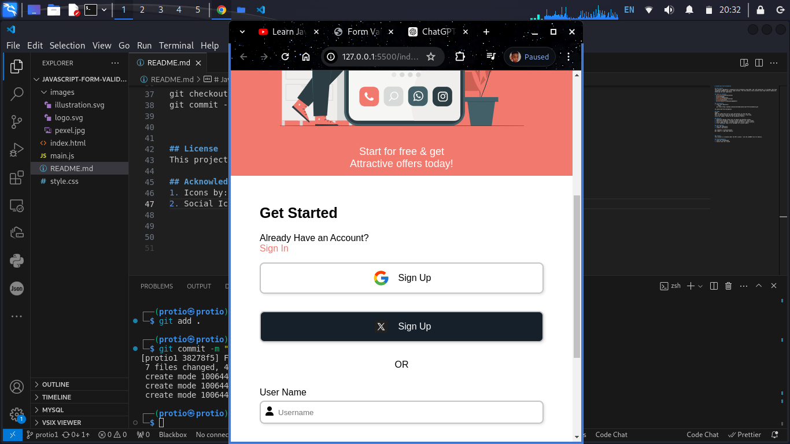

# JavaScript Form Validation

## Description
This project implements a responsive form validation using HTML, CSS, and JavaScript. It includes real-time validation feedback and social login buttons. The form ensures users provide valid input before submission, enhancing the user experience.

## Table of Contents
- [Installation](#installation)
- [Usage](#usage)
- [Features](#features)
- [Contributing](#contributing)
- [License](#license)
- [Acknowledgements](#acknowledgements)

## Installation
1. Clone the repository:
   ```bash
   git clone https://github.com/yourusername/javascript-form-validation.git

cd javascript-form-validation

## Usage
Usage
Open the index.html file in your web browser to view the form.
Fill in the form fields and observe the validation in real-time.
Click the "Submit" button to see validation results.

## Features
1. Responsive Design: Works well on mobile and desktop screens.
2. Real-time Validation: Provides instant feedback for input fields.
3. Social Login Buttons: Includes Google and Twitter sign-up options.
4. Error Handling: Shows error messages for invalid inputs.

## Contributing
1. Fork the repository.
2. Create a new branch

git checkout -b feature-branch
git commit -m 'Add some feature'


## License
This project is licensed under the MIT License - see the LICENSE file for details.

## Acknowledgements
1. Icons by: FontAwesome
2. Social Icons by: Icons8

## Screenshots

### Form Validation Page


### Mobile View



